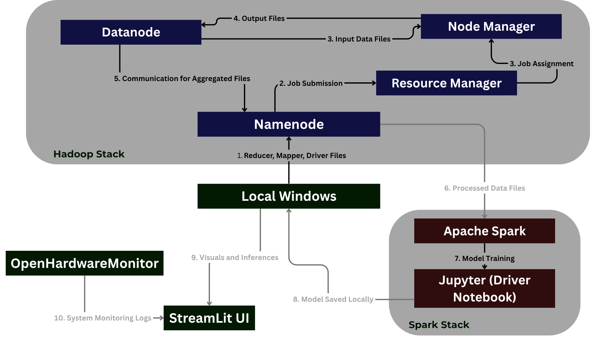

# ⚡ SPARK — Sustainable Power Analytics and Renewable Kinetics
[](https://spark-sustainable-power-analytics-and-renewable-kinetics.streamlit.app)

**Big Data Energy Analytics with Hadoop MapReduce and Apache Spark ML**

---

## 📌 Overview
**SPARK** is a scalable, modular, and extensible energy analytics platform designed for processing large-scale renewable energy datasets using the Hadoop MapReduce framework. It offers data analytics, machine learning-based forecasting, and energy trend insights in a fully modular setup.

---
Our energy analytics platform is designed to achieve the following key objectives:

1. **Enhance Grid Efficiency through Predictive Analytics**  
   Leverage machine learning and historical data to forecast energy demand, optimize grid operations, and minimize load imbalance.

2. **Encourage Renewable Adoption with Actionable Insights**  
   Provide clear, data-driven analysis of solar, wind, and other renewable sources to empower stakeholders in making sustainable energy decisions.

3. **Reduce Fossil Dependency via Informed Planning**  
   Analyze usage patterns to support strategies that reduce reliance on coal, oil, and gas, promoting a cleaner energy mix.

4. **Support Energy Policy with Evidence-Based Analysis**  
   Deliver insights derived from historical data to assist policymakers in crafting effective, climate-resilient energy policies.
---
## 🔑 SPARK at a Glance

SPARK (Sustainable Power Analytics and Renewable Kinetics) leverages big data and machine learning to deliver a unified platform for intelligent energy analysis. Key capabilities include:

- Load Forecasting: Accurate short- and long-term demand predictions for optimized energy distribution and grid stability.

- Energy Source Analysis: Deep insights into both renewable (solar, wind) and non-renewable (coal, gas, oil, nuclear) generation — covering trends, efficiency, and environmental impact.

- Correlation & Seasonal Trends: Uncovers relationships between demand, weather, and production; identifies seasonal consumption patterns to support strategic planning.

- Comparative Evaluation: Visual and data-driven comparisons across energy types to guide policy, investment, and transition strategies.

---
## 📁 Project Structure

```bash
SPARK-Sustainable-Power-Analytics-and-Renewable-Kinetics/
│
├── data/              # datasets
├── mapreduce/         # Java MapReduce jobs for large-scale data processing
│   ├── FossilFuelDependency/           # Job to calculate fossil fuel dependency
│   │   ├── ffd.csv                     # Output Dataset
│   │   ├── FossilFuelDependencyDriver.java
│   │   ├── FossilFuelDependencyMapper.java
│   │   ├── FossilFuelDependencyReducer.java
│   │   └── readme                      # Notes/documentation for this module
│   ├── LoadForecast/                   # Energy demand forecasting
│   ├── renewable/                      # Renewable source processing 
│   ├── nonrenewable/                   # Coal, gas, etc. analytics
│   ├── weather/                        # Impact of temperature, wind, etc.
├── ml-modelling/      # Jupyter Notebooks and ML models for energy forecasting
│   ├── Models           # Joblin Files of models
│   ├── renewable-predictions.ipynb     #ipynb file for pre processing and training
├── monitoring/        # Scripts and modules for real-time monitoring
├── ui/                # Streamlit/CLI-based UI interface
│   ├── app.py         # Without System monitoring
│   ├── testui.py      # With System monitoring
│   ├── testapp.py     # Test UI for only System monitoring
├── commands.txt       # Execution and helper commands
├── requirements.txt   # Python dependencies
└── README.md          # You're here!
```
# 🚀 Tech Stack & Workflow Summary

This document outlines the architecture of a big data processing environment containerized with Docker and details the command-line workflow for extracting processed data.



---
## 🧱 Stack Breakdown

### Hadoop Stack

| Component         | Description |
|------------------|-------------|
| **Local Windows** | Source of Mapper, Reducer, and Driver `.java` or `.jar` files |
| **Namenode**     | Receives and stores job binaries and handles HDFS metadata |
| **Resource Manager** | Assigns jobs to appropriate Node Managers using YARN |
| **Node Manager** | Executes tasks (Mapper/Reducer) in allocated containers |
| **Datanode**     | Stores input/output blocks used during job execution |


1. Reducer, Mapper, and Driver files are submitted from **Local Windows** to **Namenode**.
2. **Namenode** submits job instructions to **Resource Manager**.
3. **Resource Manager** assigns tasks to **Node Manager**.
4. **Node Manager** fetches input data from **Datanode** and writes output back to it.
5. Aggregated files are communicated back through **Namenode**.

---

### Spark Stack

| Component         | Description |
|------------------|-------------|
| **Apache Spark** | Reads the processed data files and performs ML operations |
| **Jupyter (Driver Notebook)** | Interactive interface to trigger and monitor model training |

6. Processed data files are sent to **Apache Spark**.
7. Spark performs model training through the **Jupyter Notebook**.
8. Trained models are saved locally to **Local Windows**.

---

### UI & Monitoring

| Component            | Description |
|---------------------|-------------|
| **Streamlit UI**    | Displays the inference results, charts, and visualizations |
| **OpenHardwareMonitor** | Monitors system metrics like CPU, RAM, etc. during execution |

9. Local inferences and visuals are passed to **Streamlit UI**.
10.  **OpenHardwareMonitor** logs system performance and passes it to **Streamlit UI**.
---
### How to run
Make sure to install virtual env and under `requirements.txt` uncomment the commented packages.
Since all the Mapreduce jobs have already been executed and final files stored, onyl part left out is the UI. To run it,
```bash
streamlit run ui/testui.py
```

Make sure to have [Open Hardware Monitor](https://openhardwaremonitor.org/) running in background with its remote web server enabled to get System Monitoring. If system monitoring isn't needed, run,
```bash
streamlit run ui/app.py
```


